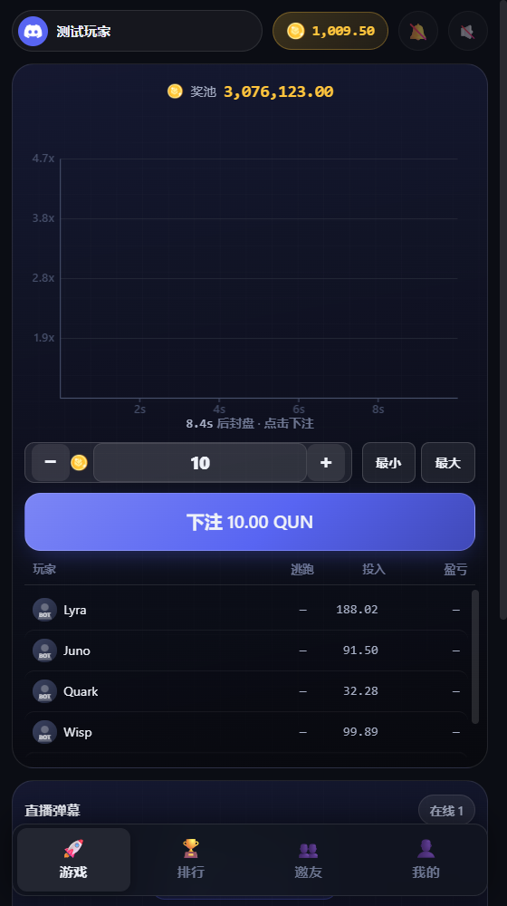
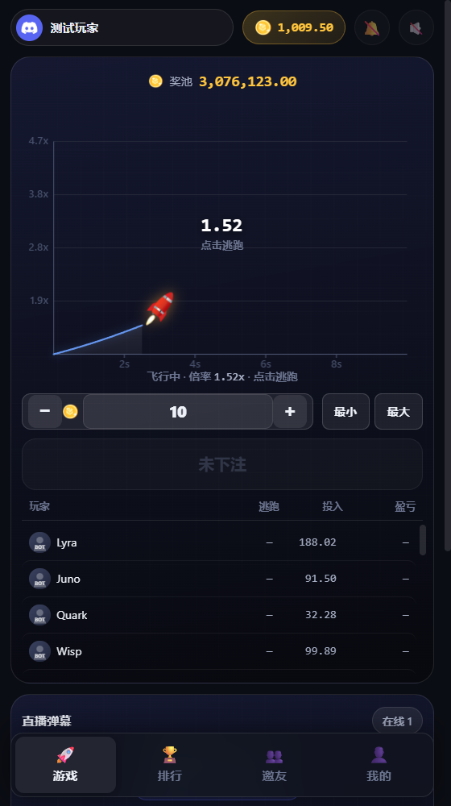
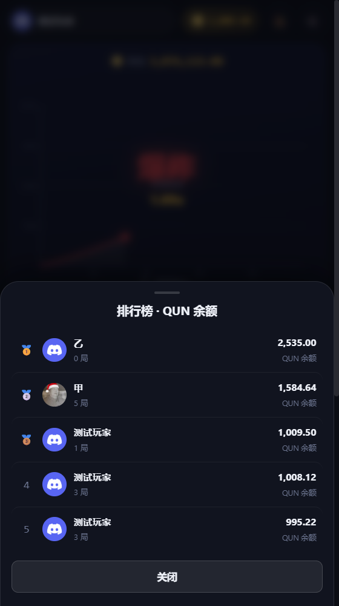
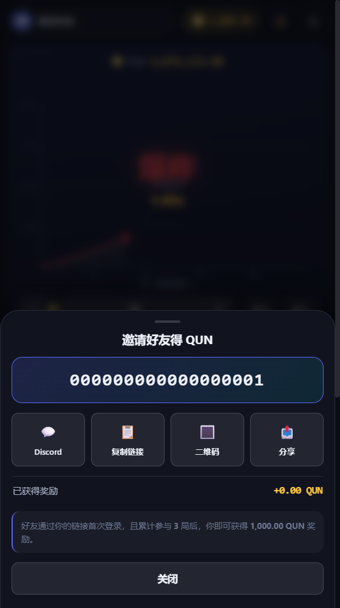
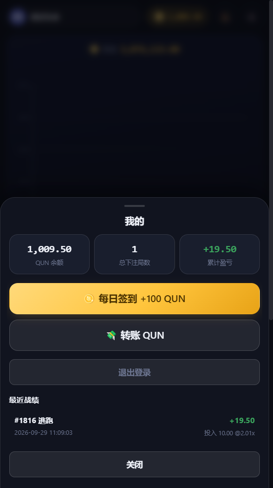
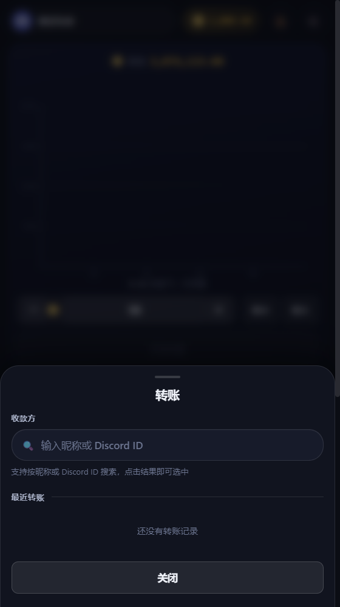
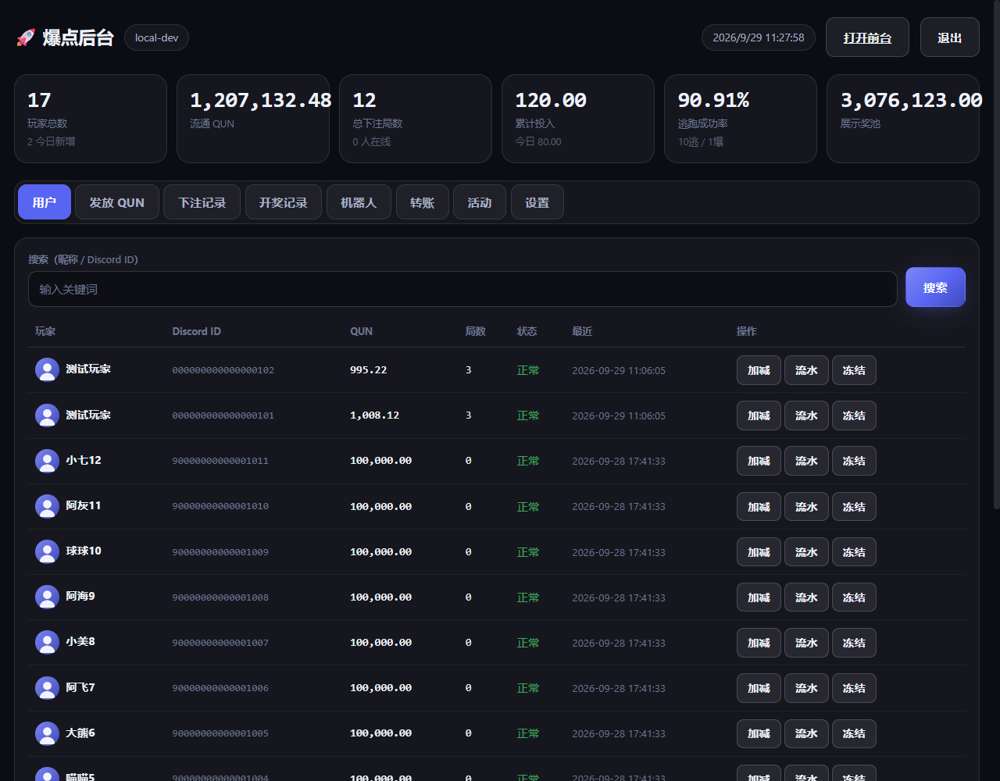

# 爆点逃跑 · Boom

> Discord 社区小游戏 —— 火箭起飞前跑掉，赢下你的倍率。
> Node.js + 内置 SQLite，单进程同时跑 HTTP / WebSocket / 游戏循环，**零外部服务依赖**。

[](https://nodejs.org)


---

## 这是什么

玩家用 Discord 登录拿到 **QUN**（社区娱乐积分），每局在 10 秒下单窗口里押注。
封盘后火箭起飞，倍率随时间一路上涨；点「逃跑」就按**当前倍率**结算落袋。
不点就等着爆点，血本无归。

一局 **10 秒下单 + 5 秒封盘 + 飞行**，全程服务端绝对时间控制，
客户端倒计时和服务端误差 < 0.1 秒。

### 页面一览

| 游戏主界面（下单阶段） | 飞行中 |
|---|---|
|  |  |

| 排行榜 | 邀好友 |
|---|---|
|  |  |

| 我的 | 转账 |
|---|---|
|  |  |

### 后台



用户 / 发放 QUN / 下注记录 / 开奖记录 / 机器人 / 转账 / 活动 / 设置 八个页签，
与前台同一套深色设计语言。

---

## 核心特性

**游戏**
- 10 秒下单 + 5 秒封盘，服务端绝对时间戳（`betEndAt` / `lockEndAt`）驱动倒计时
- 资金池反推赔率，支持五种赔率模式（新增三段加权 + 瞬爆）
- 中途加入自动恢复当前阶段 / 倍率 / 已飞时间 / 曲线 / 火箭 / 下注列表
- 每局每人仅一次下注，SQLite 事务保证不重复扣款
- Canvas 每 100ms 生长曲线，动态秒轴 + 倍率轴，火箭贴曲线尖

**账号与经济**
- Discord OAuth2 + PKCE，活动内走 Embedded App SDK 静默授权
- 首次登录 1000 QUN，有效邀请双方各再得 1000 QUN
- 每日签到、原子转账（金币 / 用户搜索 / 余额 / 转账记录）
- 排行榜展示所有用户余额

**运营**
- 每日高倍活动：北京时间 18:00-23:00 之间**随机抽一小时**，倍率 1x-100x
- 活动开始前一分钟创建 Discord Guild Scheduled Event，开始时复用并发频道消息
- 小活动插件框架（`server/activities/`），已内置幸运时段 / 新人保护

**隐私**
- QUN 仅为游戏内娱乐积分，**不可充值、不可提现、不可兑换任何现实价值**

---

## 环境要求

| | 要求 | 说明 |
|---|---|---|
| Node.js | **>= 22.5.0** | 必须。数据库用内置 `node:sqlite`，低版本没有这个模块 |
| 数据库 | 无需安装 | SQLite 单文件，随项目走 |
| 反向代理 | 可选 | 生产建议 nginx（Caddy 也行），主要为了 HTTPS + WebSocket 升级 |

> ⚠️ **Node 版本是最容易踩的坑**。Node 18/20 没有 `node:sqlite`，
> 启动会直接报 `Cannot find module 'node:sqlite'`。
> 发行版自带的 Node 往往是 18，**务必先确认版本**：
> ```bash
> node -v   # 必须 >= v22.5.0
> ```

---

## 快速开始

### 1. 拉代码

```bash
git clone https://github.com/<你的账号>/boom.git
cd boom
npm install          # 只装一个依赖：ws
```

### 2. 配置环境变量

```bash
cp .env.example .env
```

编辑 `.env`，**至少要填这四项**：

```ini
DISCORD_CLIENT_ID=你的 Application ID
DISCORD_CLIENT_SECRET=你的 Client Secret
DISCORD_BOT_TOKEN=你的 Bot Token
ADMIN_DISCORD_IDS=你的 Discord ID      # 谁能进后台
```

再去 [Discord 开发者后台](https://discord.com/developers/applications) 配 OAuth2 回调：

```
https://你的域名/auth/callback
```

> 本地调试可以填 `https://127.0.0.1:8080/auth/callback`，
> 但**线上正式地址只能有一个**（Discord 端 redirect 与服务端必须一致）。

### 3. 启动

```bash
npm start
```

看到这段就成了：

```
  ┌─────────────────────────────────────────┐
  │  爆点逃跑 · Baodian                       │
  └─────────────────────────────────────────┘
  游戏:    http://127.0.0.1:8080/
  后台:    http://127.0.0.1:8080/admin/
  Discord: 已配置 (xxxxxxxxxxxx)
  WebSocket: ws://127.0.0.1:9501/ws
```

Windows 用户双击 `start.bat` 即可；Linux / macOS 用 `./start.sh`。

---

## 部署到服务器

### 方式一：systemd + nginx（推荐）

**1. 装 Node 22+**

```bash
node -v   # 若 < v22.5.0，升级：
curl -fsSL https://deb.nodesource.com/setup_22.x | bash -
apt-get install -y nodejs
```

**2. 放代码**

```bash
mkdir -p /root/boom && cd /root/boom
# 把仓库内容放进来（git clone 或 scp）
npm install --omit=dev
cp .env.example /root/.env && vi /root/.env   # .env 放仓库外，权限收紧
chmod 600 /root/.env
```

> `.env` **不要放在仓库目录里**，放 `/root/.env` 之类仓库外的地方，
> 避免误提交，也避免 `git pull` 覆盖。

**3. 端口规划**

项目默认 HTTP `8080` / WS `9501`。如果这两个端口已被占用（服务器上很常见，
比如 Docker 占着 8080），改 `.env` 里的 `HTTP_PORT` / `WS_PORT` 即可。

**4. systemd 服务**

`/etc/systemd/system/boom.service`：

```ini
[Unit]
Description=Boom Discord Activity
After=network.target

[Service]
Type=simple
WorkingDirectory=/root/boom
ExecStart=/usr/bin/node server/index.js
Restart=always
RestartSec=3
Environment=NODE_ENV=production
StandardOutput=append:/root/boom/boom.log
StandardError=append:/root/boom/boom.log

[Install]
WantedBy=multi-user.target
```

```bash
systemctl daemon-reload
systemctl enable --now boom
systemctl status boom
```

**5. nginx 反代 + WebSocket 升级**

```nginx
server {
    listen 80;
    server_name your-domain.example.com;

    location / {
        proxy_pass http://127.0.0.1:8080;
        proxy_http_version 1.1;
        proxy_set_header Host $host;
        proxy_set_header X-Real-IP $remote_addr;
        proxy_set_header X-Forwarded-For $proxy_add_x_forwarded_for;
        proxy_set_header X-Forwarded-Proto $scheme;
    }

    # WebSocket：Upgrade 头必须透传，否则前端一直「加载中」
    location /ws {
        proxy_pass http://127.0.0.1:9501;
        proxy_http_version 1.1;
        proxy_set_header Upgrade $http_upgrade;
        proxy_set_header Connection "upgrade";
        proxy_set_header Host $host;
        proxy_read_timeout 600s;
    }
}
```

```bash
nginx -t && systemctl reload nginx
```

**6. 上 HTTPS**（必做，Activity 和 Cookie 都需要）

```bash
certbot --nginx -d your-domain.example.com
```

### 方式二：Docker

项目本身零外部服务依赖，直接挂数据目录即可：

```dockerfile
FROM node:22-slim
WORKDIR /app
COPY package*.json ./
RUN npm install --omit=dev
COPY . .
ENV HTTP_PORT=8080 WS_PORT=9501
EXPOSE 8080 9501
CMD ["node", "server/index.js"]
```

```bash
docker build -t boom .
docker run -d --name boom --restart always \
  -p 8080:8080 -p 9501:9501 \
  -v /root/boom-data:/root/data \
  --env-file /root/.env \
  boom
```

---

## 部署后必查清单

| # | 检查 | 期望 | 不对时 |
|---|---|---|---|
| 1 | `curl -I https://你的域名/` | `200` | 检查 nginx / systemd |
| 2 | `curl https://你的域名/api/me` | 返回 JSON（未登录也要 200） | 检查路由 |
| 3 | 浏览器打开首页 | 出现登录页，不卡「加载中」 | 见下方排查 |
| 4 | Discord 登录 | 跳转并回到游戏 | 检查 redirect URI 是否与后台一致 |
| 5 | 游戏能下注 | 10 秒后封盘、起飞、爆点 | 检查 WS |
| 6 | `/admin` 能进 | 八个页签正常 | 检查 `ADMIN_DISCORD_IDS` |

### 前端一直「加载中」

九成是 **WebSocket 没连上**。检查：

1. nginx 的 `location /ws` 有没配 `Upgrade` / `Connection` 头
2. 防火墙有没有放行 WS 端口
3. 前端连的是**同源** `/ws`（不是 `域名:9501`）—— 直连 9501 在有 CDN / 反代时基本都会失败

> 如果域名套了 Cloudflare 之类 CDN，**静态资源缓存可能长达数小时**。
> 每次发版记得改 `public/index.html` 里的 `?v=N` 版本号，
> 否则用户拿到的是旧 JS，以为改了没生效。

### iOS / Safari 登不上

Safari 默认**禁用第三方 Cookie**。项目已处理：只要 `APP_URL` 是 `https://`，
Cookie 就自动带上 `SameSite=None; Secure; Partitioned`。
确认 `.env` 里 `APP_URL` 写的是完整 https 地址（不要只写主机名）。

---

## 配置说明

完整配置见 [`.env.example`](.env.example)。几个要点：

| 变量 | 默认 | 说明 |
|---|---|---|
| `APP_URL` | — | **https 开头**才会启用 Partitioned Cookie（Activity 必需） |
| `INITIAL_COINS` | 1000 | 首次登录赠送 |
| `INVITE_REWARD_COINS` | 1000 | 邀请人奖励 |
| `INVITE_NEWCOMER_COINS` | 1000 | 被邀请人奖励（仅有效邀请时发） |
| `DEV_LOGIN` | 空 | **生产务必留空**。开了能用 `POST /api/auth/dev-login` 免 Discord 登录 |
| `BOT_GUILD_ID` / `DISCORD_EVENT_CHANNEL_ID` | 空 | 填了才会发 Discord 活动 / 消息 |

每日高倍活动的时段与倍率在**后台 → 活动**里改，不用动代码。

> `.env` 放在**项目根目录的上一级**（`baodian/../.env`），不在仓库内。
> `install.sh` 会自动补齐缺失项并生成随机密钥。

---

## 项目结构

```
boom/
├── server/
│   ├── index.js            # HTTP + WebSocket + 路由入口
│   ├── engine.js           # 游戏循环：下注 → 封盘 → 飞行 → 结算
│   ├── db.js               # SQLite 数据层 + 金币事务
│   ├── game-logic.js       # 赔率算法、飞行时长
│   ├── daily-activity.js   # 每日高倍活动 + Discord Scheduled Event
│   ├── discord-auth.js     # OAuth2 / PKCE / Bot API
│   ├── activities/         # 小活动插件（lucky-hour / newbie-protect）
│   └── routes/             # api.js（前台）· admin.js（后台）
├── public/                 # 前台静态资源
│   ├── js/vendor/discord-activity-sdk.mjs   # 本地托管的官方 SDK
│   └── assets/             # 火箭、爆炸图、BGM、音效
├── admin/index.html        # 后台单页
├── test/                   # e2e / 赔率 / 完整回归
└── scripts/                # 种子数据、结算守恒与定向推送测试
```

**为什么 SDK 要本地托管**：`@discord/embedded-app-sdk` 官方包是 70 个相对 import 的
多文件结构，Discord Activity 的 iframe 网络代理不保证能访问 jsDelivr，
远程模块加载失败时 `authorize()` 根本不会执行 —— 表现就是「点登录没反应」。
`public/js/vendor/discord-activity-sdk.mjs` 是用 esbuild 打成单文件的产物。

---

## 技术要点

**零外部服务**：只用 Node.js。数据库是内置 `node:sqlite`（需 Node ≥ 22.5），
唯一 npm 依赖是 `ws`。

**爆点时间用闭式解**替代原 PHP 的 10 万次迭代：

```
赔率曲线   rate = t/2 + (t^2 - t)/10 + 1
反解飞行时间 t = (sqrt(40*rate - 24) - 4) / 2
```

1.00-1000.00x 全区间往返误差 < 1e-2（整数毫秒舍入）。

**赔率模式 5 · 三段加权 + 瞬爆**（当前默认）

模式 4（区间随机）是**均匀分布** —— 1.10x 和 50x 出现概率完全相同。
把区间配成 `1.10–50` 会导致 81.8% 的局超过 10x、41% 超过 30x，
玩家每局都在 25x 附近逃跑，10 局净赚 5 倍本金。

模式 5 改成四段加权，先按权重决定落在哪一段，段内再均匀取值：

| 段 | 权重 | 范围 | 作用 |
|---|---|---|---|
| 瞬爆 | 5% | 1.00–1.04x | 刚起飞就没（绕过 `min_rate` 与最低飞行时长） |
| 低 | 22% | 1.10–1.70x | 甜头区，保守玩家有赚头 |
| 中 | 48% | 6.00–15.00x | 主赚区 |
| 高 | 25% | 15.00–50.00x | 爆发区 |

20 万局实测：**中位 10.31x**，平均 13.51x，10x+ 占 51.6%，瞬爆 5.1%。
玩家视角：2x 就逃成功 72.9%，按住到 10x 成功 51.6%。

后台「设置」页有全部 11 个参数，改完**实时预览爆点分布**，不用跑一天才知道效果。

> ⚠️ `DEFAULT_SETTINGS` 只在 settings 表为空时生效，**已有数据库不会自动更新**。
> 升级已有实例必须显式执行迁移：
> ```bash
> DB_FILE=/path/to/baodian.db node scripts/migrate-odds5.js            # 只看
> DB_FILE=/path/to/baodian.db node scripts/migrate-odds5.js --apply    # 写参数
> DB_FILE=/path/to/baodian.db node scripts/migrate-odds5.js --apply --force  # 连赔率模式一起切
> ```

**WebSocket 协议**（端口 `WS_PORT`，路径 `/ws`）：

| 消息 | 方向 | 说明 |
|------|------|------|
| `hello` | 服务端 | 连接成功，附带当前局快照 |
| `begin` | 服务端 | 新一期开始 `{gid, betMs, betEndAt, lockEndAt}` |
| `bets` | 服务端 | 玩家下注 `{memberid, nickname, head_url, bet}` |
| `bets_done` | 服务端 | 机器人下注完毕 |
| `lock` | 服务端 | 封盘 `{gid, lockMs, lockEndAt}` |
| `takeoff` | 服务端 | 起飞 `{gid, flightMs}` |
| `escape` | 双方 | 逃跑 `{uid, escape, profit, balance, me}` —— `me:true` 只发给本人 |
| `over` | 服务端 | 爆炸 `{gid, boom, jackpot}` |
| `chat` | 双方 | 聊天与系统飘屏 |
| `ping`/`pong` | 双方 | 心跳 |

**QUN 账目**：所有增减走 `db.addCoins()`，自动写 `coin_logs` 流水，
后台可查每个用户的完整流水。爆点结算**不退本金**（下注时已扣过）。

---

## 测试

```bash
node test/full.js              # 完整回归
node test/e2e.js               # 端到端
node test/odds.js              # 赔率计算
node test/odds-weighted.js     # 模式 5 分布 + 瞬爆（20 万局）

# 以下需要服务已启动
node test/e2e-odds-e2e.js      # 真实游戏循环跑 10 局，验证爆点分布
node scripts/test-money-conservation.js   # 结算守恒（钱不能凭空产生）
node scripts/test-escape-broadcast.js     # 逃跑事件只通知本人
```

`test-money-conservation` 会校验爆点结算**不退本金**（下注时已扣过），
这是历史上真实出过的 bug：退本金会让每局白嫖一次，流水看起来像凭空造币。

---

## Discord 登录

两条通道，同一套服务端换 token 逻辑：

**A. Activity 内**（手机端）
在 Discord 内打开 Activity，页面检测到在 iframe 中后走 Embedded App SDK 的
`authorize({prompt:'none'})` 静默授权。SDK **本地托管**（见上文）。

**B. 独立网页版**
点「使用 Discord 登录」→ 跳转 `discord.com/oauth2/authorize`
→ 回调 `/auth/callback` → 服务端换 token → 建立会话（`bd_sid`，30 天）。

**开发者后台需要配置**：

1. **OAuth2 → Redirects**：`https://你的域名/auth/callback`
2. **Activities → URL Mapping**：填你的域名（如 `*.your-domain.example.com`）
3. 应用内「应用目录」勾选该 Activity

Bot 若要发组织活动，需要 `CREATE_EVENTS` + `MANAGE_EVENTS` 权限。

---

## 签到机器人对接

项目不自带 Bot。推荐用你现有的 discord.py 机器人调用 HTTP 接口：

```python
import httpx

API = "https://你的域名"
SECRET = "BOT_API_SECRET 的值"   # 从 .env 复制

async def checkin(discord_id: str):
    r = httpx.post(f"{API}/api/bot/checkin",
                   json={"discordId": discord_id},
                   headers={"X-Bot-Secret": SECRET}, timeout=10)
    res = r.json()["results"][0]
    if res.get("ok"):
        return f"签到成功！+{res['amount']} QUN，当前 {res['balance']}"
    return f"签到失败：{res.get('reason')}"
```

| 接口 | 用途 | body |
|------|------|------|
| `POST /api/bot/checkin` | 每日签到（自动去重） | `{"discordId":"123","amount":100}` |
| `POST /api/bot/grant` | 直接发放 | `{"discordId":"123","amount":500,"reason":"活动"}` |

鉴权：Header `X-Bot-Secret: <BOT_API_SECRET>`

---

## 邀请奖励

好友通过 `https://你的域名/?invite=<你的discord_id>` 首次登录，
系统记录邀请关系并给双方各发 `INVITE_NEWCOMER_COINS` / `INVITE_REWARD_COINS`。
好友累计参与满 `INVITE_MIN_ROUNDS` 局后，邀请人再获 `INVITE_REWARD_COINS`。

---

## 常见问题

**改了 `.env` 要重启才生效** — 后台改参数即时生效，环境变量需重启进程。

**Q：下注按钮一直灰色？**
A：正常行为。`betting` 阶段可下注，`betting-lock` 封盘后变「已封盘」，
飞行中变「逃跑！」（自己下注了才能点，没下注显示灰色「未下注」）。
封盘是服务端阶段，不是前端猜的。

**Q：为什么爆点时间不告诉我？**
A：故意不显示。页面和 WebSocket 都不透露预计爆点或剩余爆炸时间，
否则可以直接反推下注时机。

**Q：活动为什么在我这个时间不开？**
A：每日活动按**北京时间**判定（服务器时区是 UTC，代码里显式换算过）。
抽中时段是 18:00-23:00 之间随机一小时，**当天首次启动时确定并落库**，
当天重启不会变，跨天才重选。用 `GET /api/daily` 查当前状态。

**Q：想清空数据重来？**
A：`node server/reset.js --yes`

**Q：本地调试不想走 Discord？**
A：`DEV_LOGIN=1 npm start`，然后在前端控制台调 `POST /api/auth/dev-login`
（仅限 localhost，**生产务必关掉**）。

---

## 许可

MIT。QUN 仅为游戏内娱乐积分，与任何现实价值无关。
